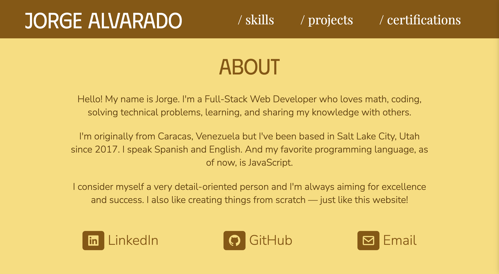
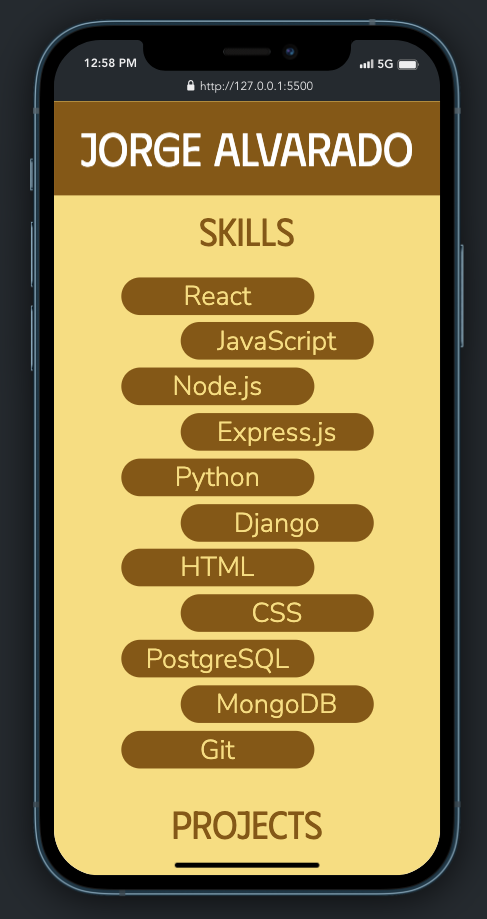

# Jorge Alvarado's Portfolio

### Link to the website: https://georgealv96.github.io/jorgealvaradoportfolio/

This project is my very first portfolio website. I decided to make it simple on purpose, using very basic technologies. Here I show a little bit about me and a few of the things I enjoy doing and have knowledge of. I also posted some of the projects I've worked on, my certificates as well as where to contact me and/or find me online.

I'd like to keep updating this project with new features and make it look fancier or create a different portfolio using more advanced technologies as I grow in the field.

### There's always room for improvement. We never stop learning!

## Technologies Used:

-HTML  
-CSS  
-A little bit of JavaScript and jQuery 

## Screenshots:

 

